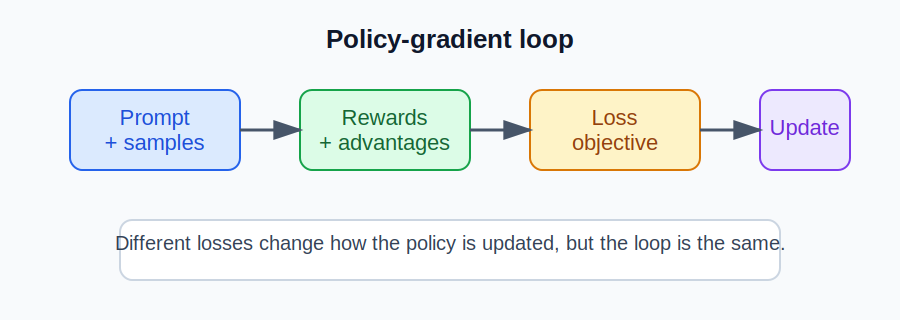
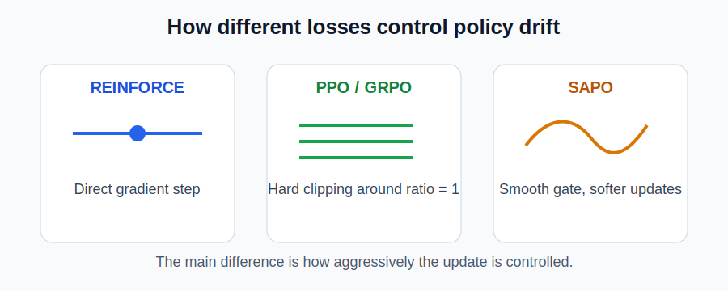

# Loss functions and learning methods

This guide explains the main policy-gradient losses used in this repository and when each one is a good fit. The implementations live in [loss.py](../loss.py).

For a companion explanation of how negative examples are generated and used in the RLHF pipeline, see [negative-examples-guide.md](negative-examples-guide.md).

## 1. The big picture

All of these methods optimize the same basic idea:

1. Generate one or more completions for a prompt.
2. Score each completion with a reward.
3. Convert rewards into advantages.
4. Update the policy with a loss that encourages better completions.

A simple view is:

## 2. Quick comparison

| Method | Core idea | Best when | Main trade-off |
|---|---|---|---|
| REINFORCE | Direct policy-gradient update with advantages | You want the simplest baseline | Can be noisy and unstable |
| PPO | Clipped policy update + value baseline | You want a strong default for RLHF | Needs a value model |
| GRPO | Group-relative advantage normalization across multiple samples | You want stable updates without a value model | Requires multiple rollouts per prompt |
| GSPO | Sequence-level clipping | You want clipping at the full-sequence level | More coarse than token-level updates |
| CISPO | Clipped ratio with stop-gradient | You want a PPO-like objective with a different gradient signal | More specialized |
| SAPO | Smooth sigmoid gate instead of hard clipping | You want softer updates when the policy drifts | Hyperparameters matter more |
| DAPO | Decoupled clipping and dynamic sampling | You want efficiency and stronger long-sequence handling | More complex to tune |
| MaxRL | Binary reward shaping | You want a simple correctness-style objective | Less nuanced than scalar rewards |

## 3. Method-by-method intuition

### REINFORCE

REINFORCE uses the classic objective:

$$
L_{\text{REINFORCE}} = -\sum_t \log \pi(a_t \mid s_t) \cdot A_t
$$

- It is the simplest policy-gradient method.
- It directly pushes up the probability of actions with positive advantage.
- It is easy to understand, but can be unstable when updates are large.

### PPO

PPO adds clipping and a value-function baseline:

$$
L_{\text{PPO}} = L_{\text{policy}} + \lambda_v L_{\text{value}}
$$

- The policy loss clips the importance ratio so the update does not explode.
- The value loss trains a critic to estimate returns.
- This is usually the most practical default for RLHF-style training.

### GRPO

GRPO compares completions within a group and normalizes their advantages:

$$
A_i = \frac{r_i - \mu_{\text{group}}}{\sigma_{\text{group}} + \epsilon}
$$

- It works well when you sample several completions per prompt.
- It avoids a separate value model.
- It is especially common in language-model post-training.

### GSPO

GSPO applies clipping at the sequence level rather than token by token:

- It is more aligned with whole-response generation.
- It is useful when the full completion matters more than individual tokens.

### CISPO

CISPO keeps the clipped-ratio idea but changes the gradient behavior with a stop-gradient:

- The ratio is clipped, but the gradient is shaped differently from PPO.
- It is a strong alternative when you want a smoother optimization signal.

### SAPO

SAPO replaces hard clipping with a smooth gate:

- The update is softened as the ratio moves away from the on-policy region.
- It is a good choice when you want less abrupt policy changes.

### DAPO

DAPO focuses on more stable training with:

- decoupled lower and upper clipping bounds,
- token-level normalization,
- and dynamic sampling behavior.

It is useful when long generations and high-variance reward signals are present.

### MaxRL

MaxRL uses a simpler reward signal such as:

$$
r = \text{correctness} \times \text{format}
$$

- It is easy to reason about.
- It is useful for tasks where the reward is binary or strongly structured.

## 4. Which one should you pick?

A practical rule of thumb:

- Start with PPO if you want a well-tested baseline.
- Start with GRPO if you do not want a value model.
- Try SAPO or CISPO when clipping stability becomes a concern.
- Use DAPO when you need more aggressive long-sequence handling.
- Use MaxRL for simple correctness-style tasks.

## 5. Implementation notes

In this repository:

- PPO uses a value-model baseline and clipped policy updates.
- GRPO, GSPO, CISPO, SAPO, DAPO, and MaxRL are implemented in [loss.py](../loss.py).
- The choice is selected through the loss field in the training config.

## 6. Summary

The main difference between these methods is not only the formula, but the style of update:

- REINFORCE: direct and simple
- PPO: clipped and value-guided
- GRPO: group-normalized and sample-efficient
- GSPO/CISPO/SAPO: different ways of controlling policy drift
- DAPO: more specialized, long-sequence-friendly updates
- MaxRL: simple binary reward optimization
