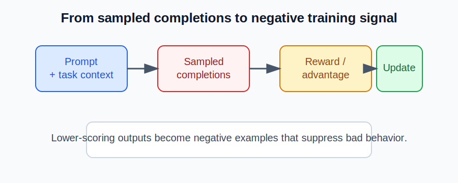

# How negative examples are generated for RLHF

This note explains how negative examples are produced in this project and why they matter for policy optimization.

## 1. What a negative example is

In RLHF, a negative example is a completion that receives a low reward because it is incorrect, poorly formatted, or otherwise undesirable. The training signal is then shaped so the model learns to reduce the probability of those outputs.

In this project, the reward pipeline typically evaluates each sampled completion against the task target and produces a scalar reward. That reward is later converted into an advantage signal that drives the policy update.

## 2. Where negative examples come from

Negative examples are usually created in one of these ways:

1. The model generates a wrong answer for the prompt.
2. The model produces a structurally invalid completion, such as missing the expected format.
3. The reward function marks the response as incorrect even if it is fluent.
4. Multiple rollouts are sampled, and some of them end up worse than others.

The training loop in this repository samples several completions per prompt, scores them, and then uses the resulting reward distribution to form advantages.

## 3. How this repository handles them

The workflow is conceptually:

1. Sample one or more completions for a prompt.
2. Compute rewards for each completion.
3. Convert rewards into advantages.
4. Update the policy so that better completions become more likely and worse ones become less likely.

A simple view of the process is:

## 4. Why negatives are useful

Negative examples are important because they create contrastive training signal:

- Positive examples show what the model should prefer.
- Negative examples show what it should avoid.
- The policy gradient loss then pushes probability mass toward preferred outputs.

Without negatives, the model has little signal to distinguish good completions from bad ones.

## 5. How the loss uses them

The losses in [loss.py](../loss.py) use advantage values derived from reward differences. A completion with a lower reward contributes a negative or less favorable advantage, which causes the update to suppress that behavior.

In practice:

- high-reward completions receive positive advantage,
- low-reward completions receive negative or weaker advantage,
- the policy is updated accordingly.

## 6. Common sources of negative examples

### Incorrect reasoning

The model may produce an answer that is factually wrong or logically inconsistent. These are strong negatives for reasoning tasks.

### Formatting violations

The model may answer with the right content but miss the expected format. For example:

- missing the final answer tag,
- extra text that breaks the extraction logic,
- or an answer that is not parseable.

### Poor diversity during sampling

In multi-rollout settings, some sampled outputs will naturally be worse than others. These become useful negative examples when the reward function penalizes them.

## 7. Practical intuition

A useful mental model is:

- good outputs = positive training signal,
- bad outputs = negative training signal,
- policy updates = move probability mass toward the good side.

This is why RLHF training benefits from having both strong and weak completions in the rollout batch.

## 8. Summary

Negative examples are generated whenever the model produces outputs that are incorrect, poorly structured, or less preferred than alternatives. They are essential because they provide the contrast needed for the policy to learn which outputs to avoid.
